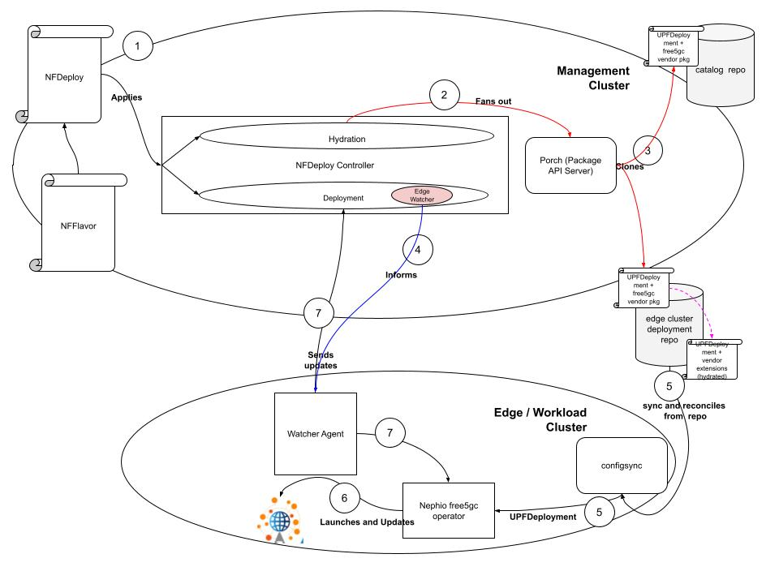

# EdgeWatcher
EdgeWatcher is a gRPC server which receives the current serialized state of Kubernetes objects from the [WatcherAgent](https://github.com/nephio-project/watcher-agent). It also exposes events for client (an example of a client is the deployment entity of [NFDeploy Controller](https://github.com/nephio-project/nf-deploy-controller) to subscribe to in getting status updates.

## Description



EdgeWatcher is a library which consists of a gRPC server to receive statuses from WatcherAgent from each of the workload clusters. It is currently utilized by the NFDeployment controller, where upon processing the NFDeployment CR, the deployment entity would create a gRPC server instance, and EdgeWatcher would be running to wait for a creation of a workload cluster (or just go through a list of currently running workload cluster), and sends a WatcherAgent CR to [WatcherAgent](https://github.com/nephio-project/watcher-agent) running on the workload cluster. This CR will inform the resources which EdgeWatcher is requesting this WatcherAgent to watch, and the gRPC endpoint where that WatcherAgent will send status update to. EdgeWatcher also exposes a [List/Watch Interface](https://www.baeldung.com/java-kubernetes-watch) for client to subscribe to such that the client would be able to watch XXXDeployment objects on workload cluster. The following diagram depicts the relationship between EdgeWatcher and its client, and the WatcherAgents running on workload cluster:


## Getting Started
EdgeWatcher is a go module, build EdgeWatcher via:
```sh
make build
```

### from the client
1. import the EdgeWatcher module:
```sh
import (
  edgewatcher "github.com/nephio-project/edge-watcher"
)
```

2. instantiate the EdgeWatcher instance (as an example):
	
```sh
var edgeWatcherConfig edgewatcher.Params
edgeWatcherConfig.K8sDynamicClient, err = dynamic.NewForConfig(mgr.GetConfig())
edgeWatcherConfig.PorchClient = porch.NewClient(ctrl.Log.WithName("PorchClient"),
        porchclient, k8sRestClient)
edgeWatcherConfig.GRPCServer = grpc.NewServer(grpcOpts...)
ep, err := edgewatcher.New(ctx, edgewatcherLogger, edgeWatcherConfig,)
```

**NOTE**: client does have to manually run the gRPC server:
```sh
   go func() {
        err := edgeWatcherConfig.GRPCServer.Serve(lis)
        if err != nil {
            setupLog.Error(err, "starting grpc server failed")
            os.Exit(1)
        }
    }()
```
	
3. Client then can subscribe to a particular event

```sh
subscribeReq := edgewatcher.SubscriptionReq{
...
}
```

### Uninstall CRDs
To delete the CRDs from the cluster:

```sh
make uninstall
```

### Undeploy controller
UnDeploy the controller to the cluster:

```sh
make undeploy
```

## Contributing
// TODO: Add detailed information on how you would like others to contribute to this project

